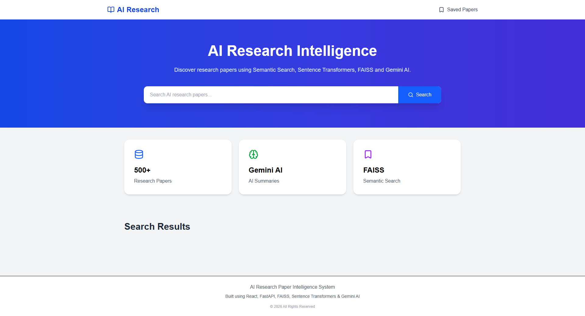
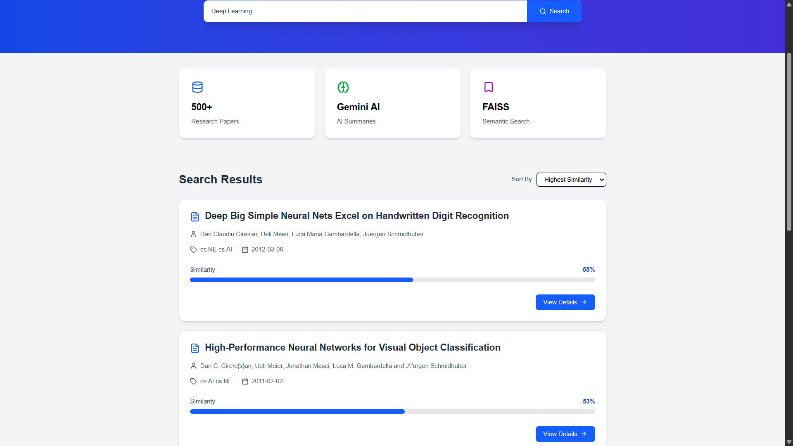
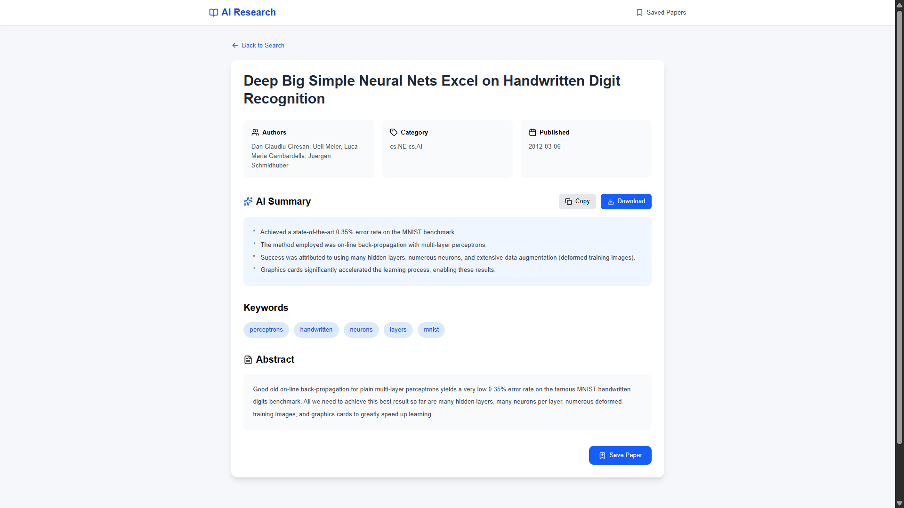
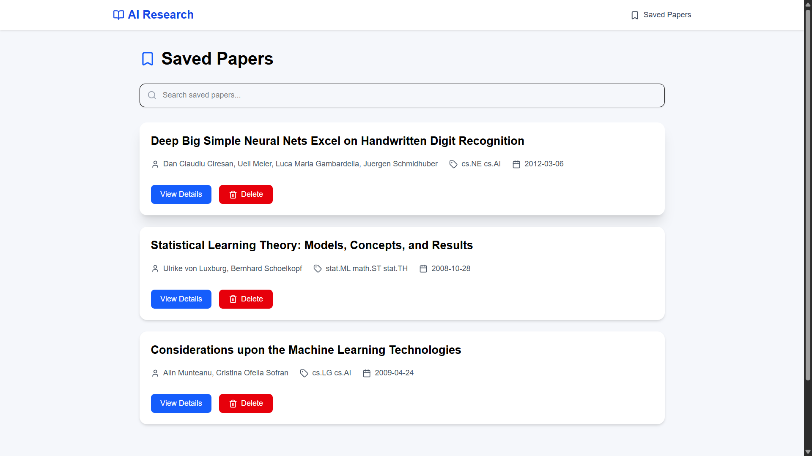

# 🤖 AI Research Paper Intelligence System

An AI-powered research paper search platform that enables users to discover research papers using semantic search instead of traditional keyword matching.

The application uses Sentence Transformers to generate embeddings, FAISS for fast vector similarity search, FastAPI as the backend, React for the frontend, and Google Gemini AI for automatic research paper summaries.

---

## 📌 Features

- 🔍 Semantic Search using Sentence Transformers
- ⚡ Fast Vector Search with FAISS
- 🤖 AI Generated Summary using Gemini AI
- 🏷 Automatic Keyword Extraction
- ⭐ Save Favorite Papers
- 📜 Search History
- 🔄 Sort Search Results
- 📄 Detailed Paper Information
- 📋 Copy AI Summary
- ⬇ Download Summary
- 📱 Responsive User Interface

---

## 🛠 Tech Stack

### Frontend

- React
- Vite
- Tailwind CSS
- Axios
- React Router
- React Hot Toast
- Lucide React

### Backend

- FastAPI
- Python
- Sentence Transformers
- FAISS
- SQLite
- Pandas
- NumPy
- Google Gemini API

---

# 📂 Project Structure

```
AI-Research-System/
│
├── backend/
│   │
│   ├── app/
│   │   │
│   │   ├── core/
│   │   │   ├── resources.py
│   │   │   └── config.py
│   │   │
│   │   ├── database/
│   │   │   ├── database.py
│   │   │   └── models.py
│   │   │
│   │   ├── routers/
│   │   │   ├── search.py
│   │   │   ├── paper.py
│   │   │   └── saved.py
│   │   │
│   │   ├── schemas/
│   │   │   └── paper.py
│   │   │
│   │   ├── services/
│   │   │   ├── search_service.py
│   │   │   ├── keyword_service.py
│   │   │   ├── summary_service.py
│   │   │   └── paper_service.py
│   │   │
│   │   └── main.py
│   │
│   ├── data/
│   │   ├── arxiv-metadata-oai-snapshot.json
│   │   ├── ai_ml_papers.csv
│   │   ├── paper_embeddings.npy
│   │   ├── paper_faiss.index
│   │   └── README.md
│   │
│   ├── scripts/
│   │   ├── filter_dataset.py
│   │   ├── generate_embeddings.py
│   │   ├── add_ids.py
│   │   └── build_faiss.py
│   │ 
│   └── requirements.txt
│
├── frontend/
│   │
│   ├── public/
│   │
│   ├── src/
│   │   │
│   │   ├── assets/
│   │   │
│   │   ├── components/
│   │   │   ├── Navbar.jsx
│   │   │   ├── Footer.jsx
│   │   │   ├── SearchBar.jsx
│   │   │   ├── SearchHistory.jsx
│   │   │   ├── SortDropdown.jsx
│   │   │   ├── PaperCard.jsx
│   │   │   ├── Loading.jsx
│   │   │   ├── EmptyState.jsx
│   │   │   └── Stats.jsx
│   │   │
│   │   ├── pages/
│   │   │   ├── Home.jsx
│   │   │   ├── PaperDetails.jsx
│   │   │   └── SavedPapers.jsx
│   │   │
│   │   ├── services/
│   │   │   └── api.js
│   │   │
│   │   ├── App.jsx
│   │   ├── main.jsx
│   │   └── index.css
│   │
│   ├── package.json
│   ├── vite.config.js
│   └── eslint.config.js
│
├── screenshots/
│   ├── home.png
│   ├── search.png
│   ├── details.png
│   └── saved.png
│
├── .gitignore
└── README.md
```

---

## 🚀 Installation

### Clone Repository

```bash
git clone https://github.com/SohamDey2005/AI-Research-Paper-Intelligence-System.git
```

### Backend

```bash
cd backend

python -m venv venv

venv\Scripts\activate

pip install -r requirements.txt
```

### Frontend

```bash
cd frontend

npm install

npm run dev
```

---

## 🔍 How It Works

1. User enters a research topic.

2. Sentence Transformer converts the query into an embedding.

3. FAISS searches similar embeddings.

4. Top papers are returned.

5. Gemini AI generates a concise summary.

6. Keywords are extracted.

7. User can save papers locally.

---

## 📸 Screenshots

### Home



### Search Results



### Paper Details



### Saved Papers



---

## 📡 API Endpoints

### Search Papers

GET

```
/search/?query=transformers
```

---

### Paper Details

GET

```
/paper/{id}
```

---

### Save Paper

POST

```
/saved/
```

---

### Delete Paper

DELETE

```
/saved/{id}
```

---

## 🎯 Future Improvements

- Authentication
- Dark Mode
- PDF Upload
- Citation Generator
- Research Recommendation Engine
- Advanced Filters

---

## 👨‍💻 Author

**Soham Dey**

B.E. in Computer Science & Engineering (CSE)

Machine Learning | Artificial Intelligence | Full-Stack Development

GitHub: https://github.com/SohamDey2005

LinkedIn: https://www.linkedin.com/in/sohamdeydurgapur

---